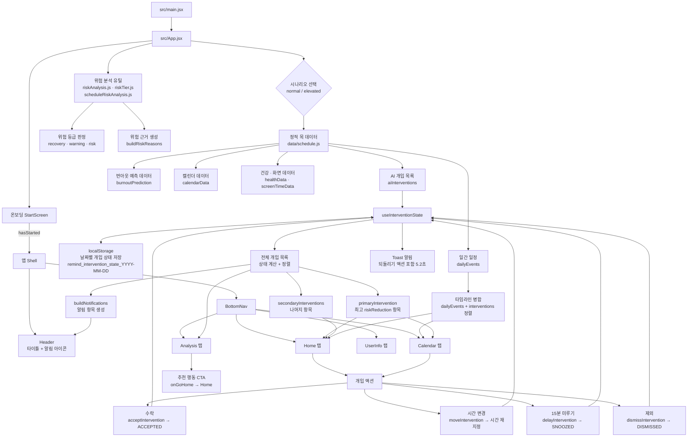

# RE:Mind

번아웃 위험 예측 및 AI 개입 제안 앱 (React + Vite)

배포 URL: https://re-mind-git-main-komosjs44-afks-projects.vercel.app/

## 시스템 흐름도



## 기술 스택

- React 19 + Vite 8
- Tailwind CSS v4
- localStorage 기반 상태 영속성

## 개발 실행

```bash
npm install
npm run dev
```

## 빌드

```bash
npm run build
```
